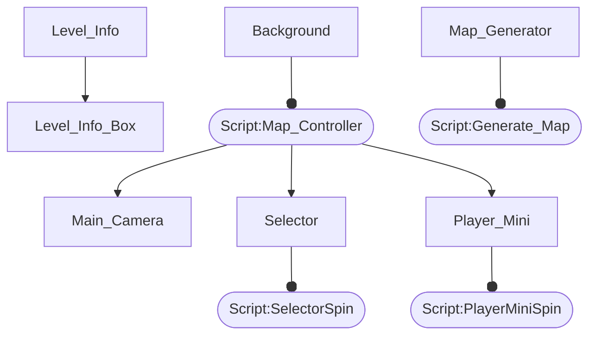
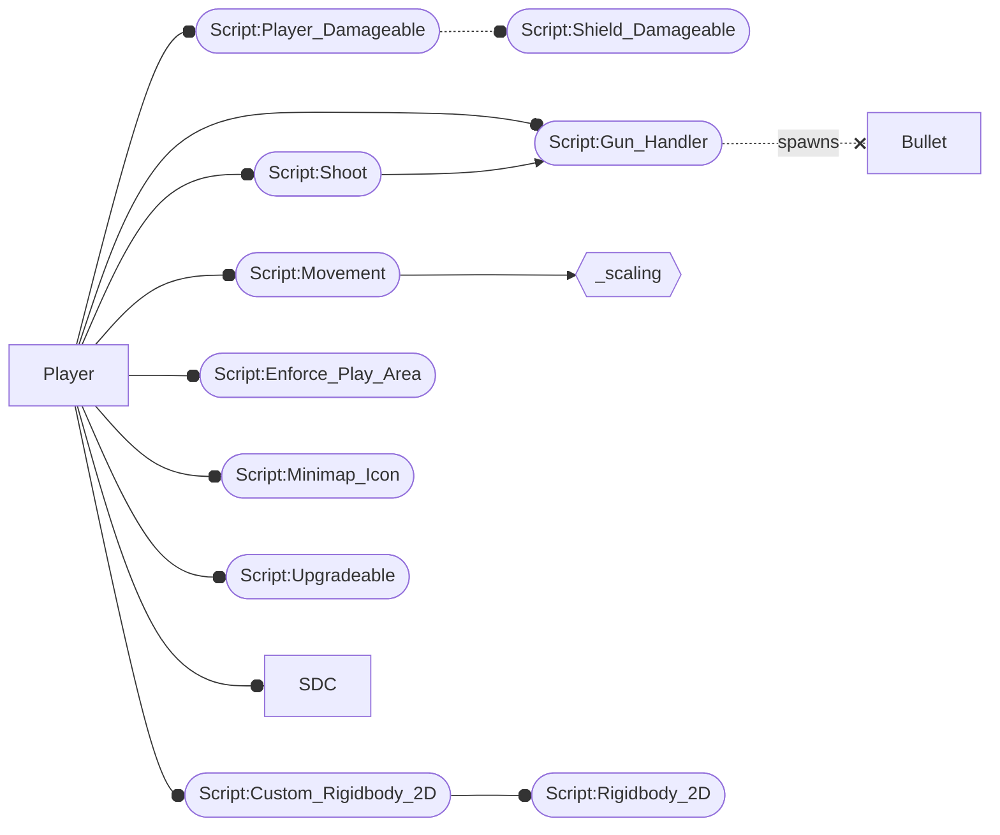

# Official Documentation
Hi, this is the section where official documentation for the GDC-Project, so that new contributors or even recurrent one's can quickly learn and use each other's code. While I'm writing this after the fact, it would be nice if others can fill this out for their code as they add it, as the more accurate this is, the better. More so the structure of this will roughly be an overview of a level of abstract and all of the systems it uses followed by more in depth detail about those systems and so and so forth recursively to a desired precision. Some parts might however fall elsewhere if they don't fit well.

### Acronyms
```
MB = Monobehaviour
SO = ScriptablObject
NS = Namespace
NS(x) = Exists in namespace x
```
### Graph Notes
Solid lines with an arrow denote modification or management. Arrows ending in a circle denote composition. Dotted arrows with an arrow head denote read only. Dotted arrows ending in an a circle denote inheritance. Arrows ending in an x have noted meaning.


## Root Scene (Level Select)
The `LevelSelect` scene acts as the entry point to the actual gameplay. This scene manages scenes, and as of `2024 01-12` only is able to move to `LevelPlay`. 
The five objects in this scene do as follows:
 - `Main Camera` = Just the camera, managed by `Background`
   - `Level Info` = Holds a script which manages and holds all of the daughter objects
	   - All children just hold text boxes or related graphics items that appear in the the box that gives planet info
 - `Background` = Runs the `Map Controller` script
	 - `Map Controller : MB` `NS(LevelSelect)` 
		 - Allows moving the screen, zooming in and out, and allows drawing paths to the target planet. 
		 - Sets and manages `Selector`. 
		 - Sets `Player Mini`'s position.
 - `Map Generator` = Holds the `Generate Map` script
	 - `Generate Map : MB` `NS(LevelSelect)` 
		 - Claims it needs refactoring, and currently might hang or fail to generate a valid level. Spawns alot of planets along a grid, creates connections, and then fuzzes the positions. Number of planets spawned is determined by evaluating a curve given the current number and if it stopping with a probability proportional to the evaluation. If you need more details, the code will have more detail
 - `Player Mini` = Has a script causing it to spin. 
 - `Selector` = Has a script causing it to spin.



## Play Scene (Level Play)
Level Play can run by itself, but it is populated by the spawning scene, so when run in isolation, may be partially to completely disfunction. It has only a small hand full of objects, but many act as spawners populating the scene. This will be followed by a section on enemy spawning and enemy mechanics.
 - `Player` = The player's actually controlled object, holds a variety of scripts which manage its behaviors
	 - Children are just particle systems and trails, purely aesthetics
	 - `Movement : MB` `NS()` 
		 - Manages the movement of the player, mostly involving three variables.
			 - `Drift Correction` = An abstract variavble which describes how quickly players turn when they move their mouse. Defaults to 5; 7 is an acceptably enjoyable value, even 10 - 20 is a useable range, but high values quickly lose the feeling of space drifting. 
			 - `Speed Limit` = Maximum speed at which a player can move, engine efficiency falls off past this point.
			 - `Acceleration` = Rate at which the player picks up speed from a stand still.
		 - Will set the `Custom Rigidbody 2D` delta time speed when dodging. 
	 - `Custom Rigidbody 2D : MB` `NS(Util)` = A wrapper around the built in `Rigidbody 2D` which allows custom time scaling. If it lacks functionality, ask a dev, or write it yourself.
	 - `Shoot : MB` `NS()` = Prompts the 	`Gun Handler` to shoot.
	 - `Player Damageable : MB` `NS()` = A modification of `Shield Damageable` which allows for saving of health between scenes. 
		 - Modifies `PlayerData`
	 - `Enforce Play Area : MB` `NS()` = Manages out of bounds attacking.
		 - On Play Area Exit (defined as a radius) decrements timer, and on or below 0 sets `attackable` bool allowing the turrets to target the player.
		 - Manages return to play area screen prompt.
	 - `Gun Handler : MB` `NS()` = Implements a basic gun, soon to be replaced with the component system when the author has sufficient time. Don't expect it to remain for the player, but is a go to for making enemies. Variables are mostly self explanatory, and hopefully the functions make sense.
	 - `Minimap Icon : MB` `NS()` = Gives the player a minimap icon
	 - `Upgradeable : MB` `NS()` = Root of upgrade system which is currently in progress.
 - `Main Camera` = 
 - `Planet` = 
	 - `Forcefield` = 
		 - `Generator` = 
 - `Boundry Circle` = 
 - `Minimap Handler + Canvas` = 
	 - `Minimap Cam`
	 - `Canvas` = See [Play Scene Canvas]() section
 - `Defenses` = 
	 - `CoilCannon` = 
 - `Enemy Spawner` = 


